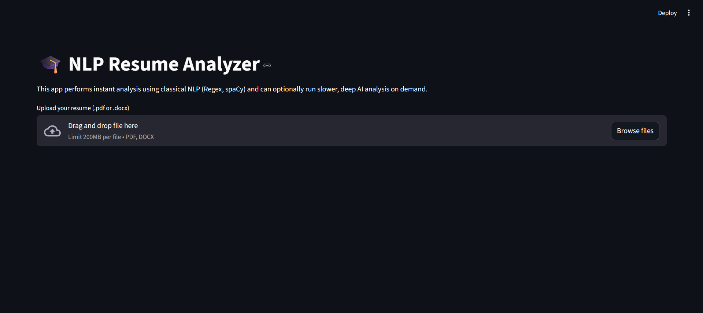
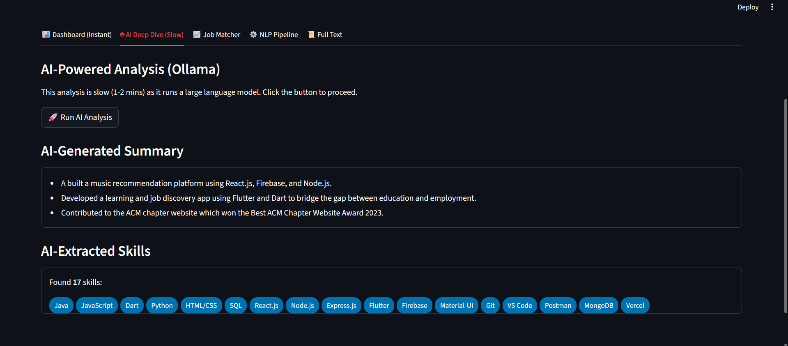
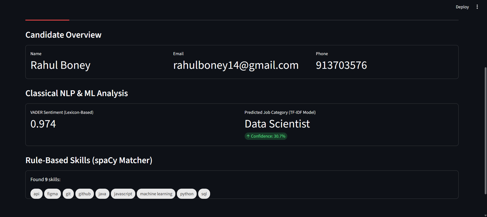
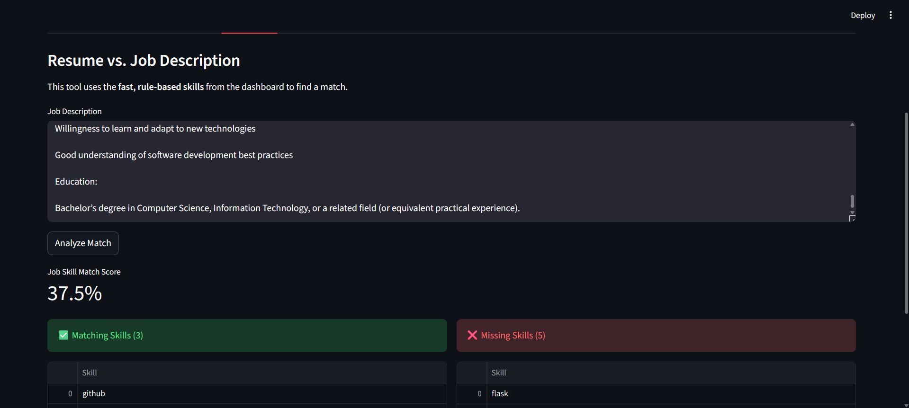
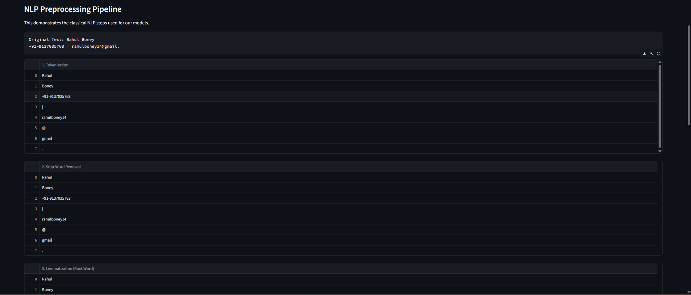
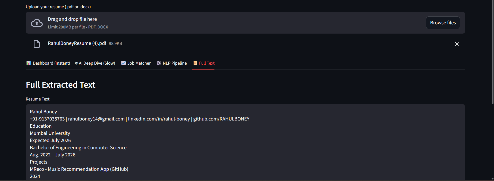

# 🎓 NLP-Powered Resume Analyzer

A Streamlit web app that uses both classical NLP techniques and modern Large Language Models (LLMs) to extract, analyze, and classify information from resumes.

This project was built as a mini-project for my Natural Language Processing course. It features a fast, responsive, multi-tab interface that intelligently separates instant "classical" NLP analysis from slower, on-demand AI analysis.

## 🚀 App Showcase

Here is a gallery of the app's core features.

| Uploading a Resume | The Instant Dashboard |
| :---: | :---: |
|  |  |
| **Classical NLP & ML Analysis** | **Job Skill Matcher** |
|  |  |
| **NLP Pipeline Visualization** | **Full Text Extraction** |
|  |  |

## ✨ Features

This app is built around a fast, multi-tab interface:

* **📊 Instant Dashboard:** The app loads instantly, providing immediate analysis using "classical" NLP:
    * **Contact Info:** Extracted using Regex and spaCy's Named Entity Recognition (NER).
    * **Sentiment Analysis:** Uses VADER to score the resume's tone.
    * **Job Classification:** Predicts the job category (e.g., "Data Scientist") using a custom-trained TF-IDF and Logistic Regression model (Accuracy: 33.33%).
    * **Rule-Based Skills:** Extracts all skills from a predefined list using spaCy's `Matcher`.

* **🤖 AI Deep Dive (On-Demand):** To solve the 3-4 minute loading time, all slow AI tasks are moved here. The user clicks a button to run the analysis on demand.
    * Uses **Ollama (llama3:latest)** to generate a professional summary.
    * Performs advanced skill extraction using the LLM's contextual understanding.

* **📈 Job Matcher:**
    * Lets you paste a job description.
    * Extracts skills from the JD using the fast, rule-based spaCy `Matcher`.
    * Compares the JD skills to the resume's skills and calculates a **match percentage**.
    * **Includes a fallback system:** If the AI model fails to extract skills, the app automatically uses the more reliable rule-based skills to ensure the matcher never breaks.

* **⚙️ NLP Pipeline:** A visual, academic breakdown of key NLP concepts, including:
    * **Tokenization**
    * **Stop-Word Removal**
    * **Lemmatization**
    * **NER Visualization** (showing `PERSON`, `ORG`, `DATE`, etc.)

## 🛠️ Tech Stack

* **Frontend:** Streamlit
* **Backend:** Python
* **NLP (Classical):** spaCy, NLTK (VADER), Scikit-learn
* **NLP (Modern):** Ollama (running `llama3:latest`)
* **Text Extraction:** `PyMuPDF` (for .pdf), `python-docx` (for .docx)
* **Utilities:** Pandas

## ⚙️ How to Run Locally

**1. Prerequisites:**
* You must have **Ollama** installed and running. [Download it here](https://ollama.com/).
* Make sure you have Python 3.9+ installed.

**2. Clone & Setup:**
```bash
# Clone the repository
git clone [https://github.com/your-username/your-repo-name.git](https://github.com/your-username/your-repo-name.git)
cd your-repo-name

# Create and activate a virtual environment
# Note: This project uses 'venv', not '.venv'
python -m venv venv
.\venv\Scripts\activate
3. Install Dependencies:
# Install all required packages
pip install -r requirements.txt

# Download the spaCy model
python -m spacy download en_core_web_sm
4. Prepare Models:
# Pull the LLM (this may take a while)
ollama pull llama3:latest

# Train the local ML classifier
python train_model.py
5. Run the App:
# Make sure Ollama is running in the background!
streamlit run app.py
<p align="center">Made with ❤️</p>
